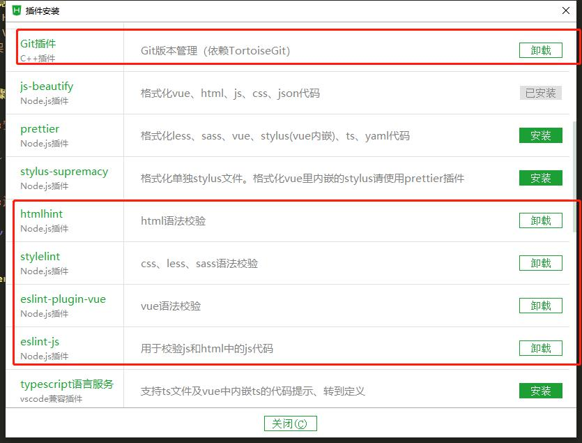
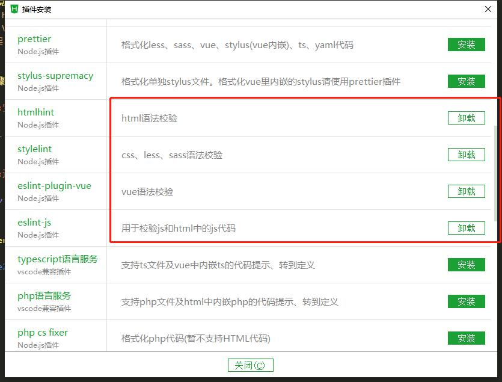
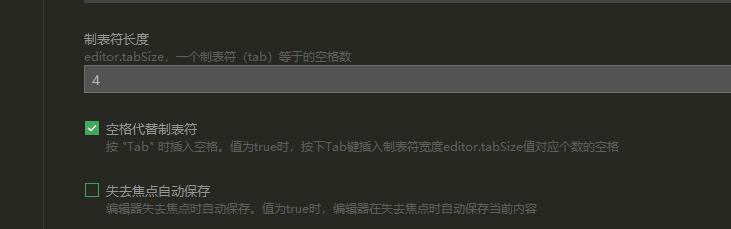
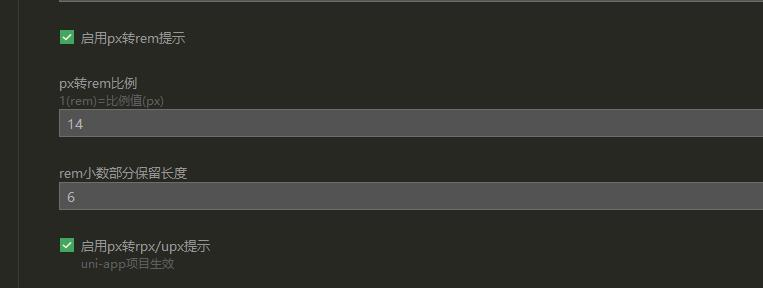

## Geo

### 目录说明

### 开发环境
- 开发工具：HbuilderX
- 前端技术：Vue.js
- 前端UI框架：https://www.iviewui.com


### HbuilderX配置
- 插件安装
 
 
 
 ```
    注： 安装git插件的时候记得安装配置TortoiseGit
 ```
 
 
- 常用配置
```
1.设置制表符长度为4
2.勾选空格代替制表符
```


- 编辑器配置
```
1.勾选启用px转rem提示
2.设置px转rem比例为14
```


### 导入项目
```
1.文件->导入->从git导入 填入本项目地址即可


```

### 开发步骤

#### Step1:安装依赖包
```
npm install
```

#### Step2:运行服务
```
npm run dev
```